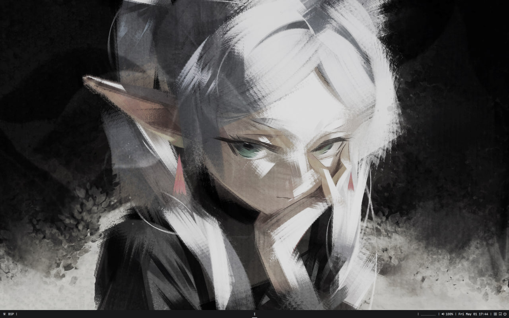
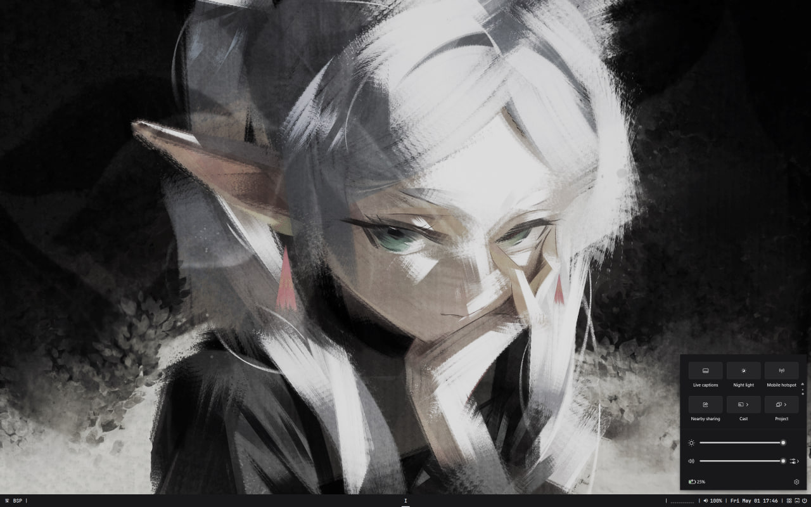
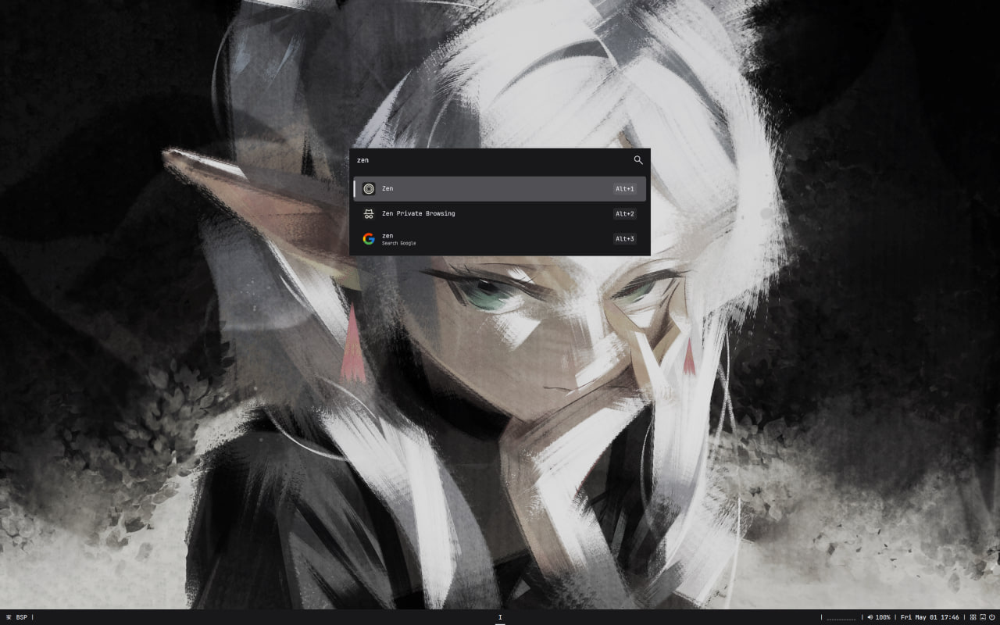
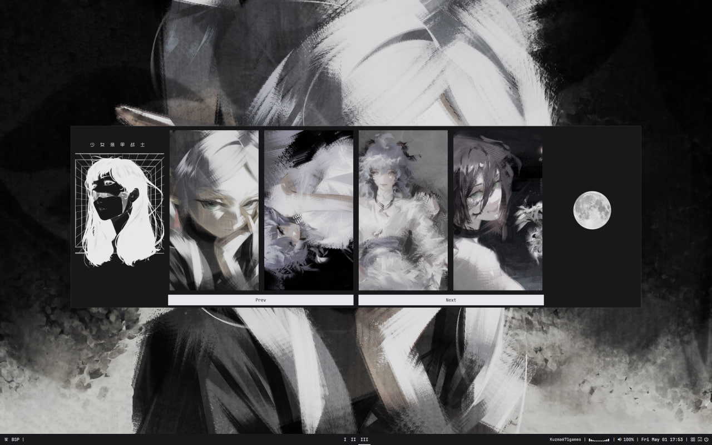
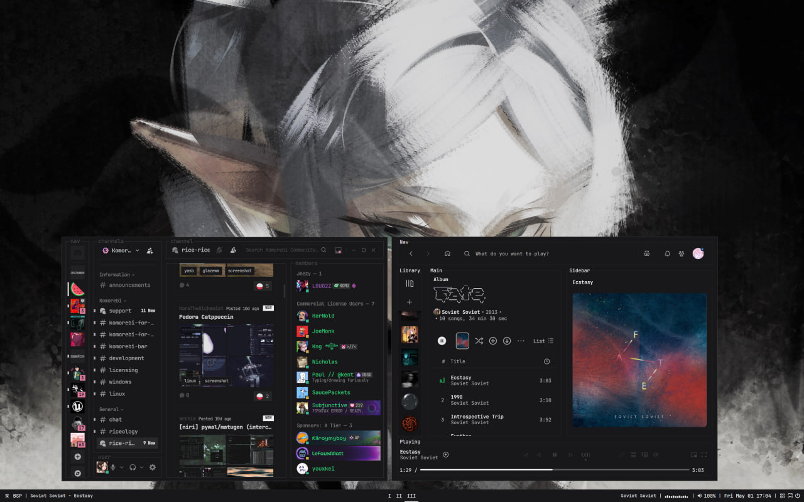
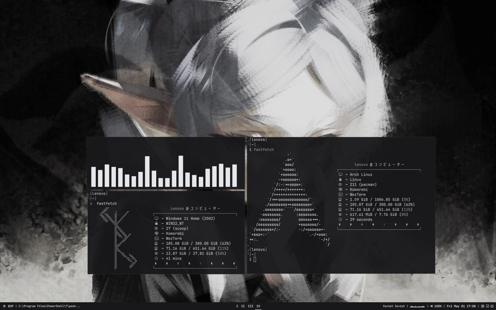
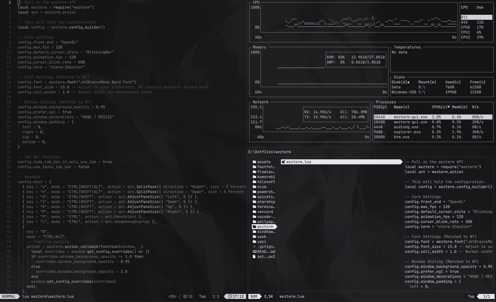
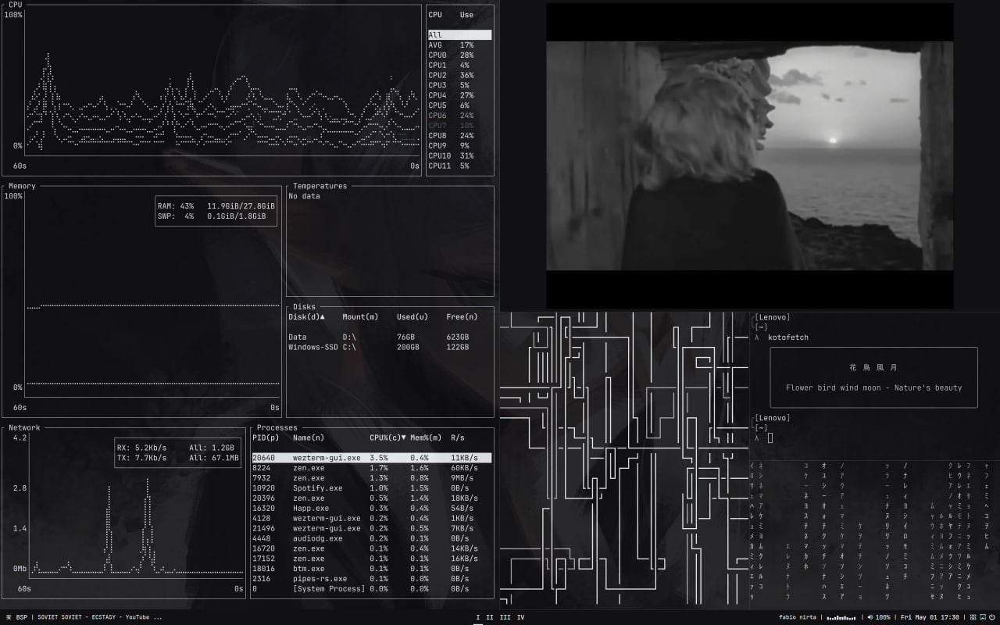
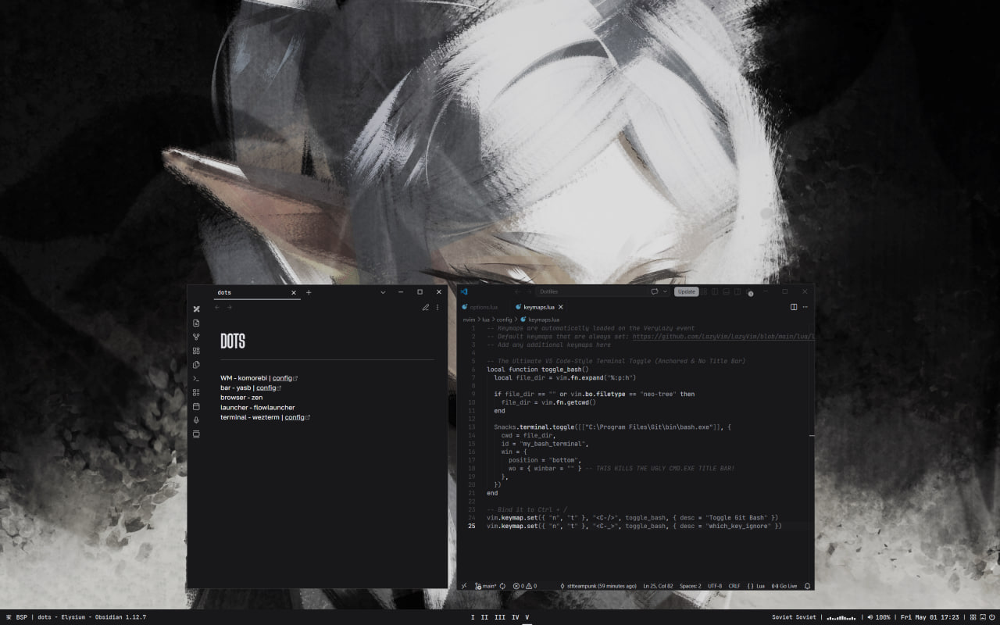

## Rice preview
<div align="center">
<details>
  <summary>Click to view rice</summary>
  
  
  
  
  
  
  
  
  
  
</details>


</div>

> _A guide to installing and configuring a full Windows ricing stack - from terminal emulator to system-level UI mods._

---

## Quick Start

If you already have some apps installed and would like to just create symlinks and dedicated directiry for dotfiles use this section.
 
> **Prerequisites:** Enable Developer Mode first — Windows requires it for symlinks.
> `Settings → System → For developers → Developer Mode → On`
 
### Run the script
 
Paste this into **PowerShell 7 as Administrator** — no cloning, no installation needed:
 
```powershell
irm https://raw.githubusercontent.com/sttteampunk/win11-rice/main/setup.ps1 | iex
```
 
Then follow the menu:
 
```
1 → Scan    detect which ricing apps are installed
3 → Deploy  create your Dotfiles directory and symlinks
4 → Check   verify everything linked correctly
```
 
That's it. The script creates `~/Dotfiles` with a subfolder for each installed app. Edit configs there - or drop in files from this repo's `dotfiles/` folder if you want my theme.
 
> **Want to preview before committing?** Run `5 → Toggle dry-run` before Deploy to see exactly what would happen without touching anything.

---

## Ricing Stack Overview

**Idle RAM usage: ~200–300 MB**

| **Tool** | **Description** | **Why It's Here** |
|---|---|---|
| [**PowerShell 7**](https://learn.microsoft.com/en-us/powershell/scripting/install/install-powershell-on-windows?view=powershell-7.6) | Modern, cross-platform shell | The backbone of your terminal - loads aliases, the Starship prompt, and custom functions natively |
| [**WezTerm**](https://wezterm.org/index.html) | GPU-accelerated terminal emulator configured via Lua | Blazing-fast rendering with image previews, multiplexing, and fully customizable hotkeys |
| [**Fastfetch**](https://github.com/fastfetch-cli/fastfetch/wiki/Configuration) | System info display tool | Written in C - extremely fast and highly customizable with ASCII art output |
| [**Starship**](https://starship.rs/) | Cross-shell prompt framework | Context-aware (shows Git branch, Node version, etc.), written in Rust, and visually clean |
| [**Neovim**](https://neovim.io/) | Hyper-extensible terminal text editor | The ultimate keyboard-driven developer editor - fully configurable via Lua |
| [**Yazi**](https://yazi-rs.github.io/) | Async terminal file manager | Navigate your drives without File Explorer - supports full image/video previews inside WezTerm |
| [**Komorebi**](https://komorebi.lgug2z.com/) | Dynamic tiling window manager for Windows | Brings Linux/bspwm-style window management to Windows - arranges windows into non-overlapping tiles |
| [**Yasb**](https://yasb.dev/) | Customizable status bar | Replaces the Windows taskbar - pairs perfectly with Komorebi to show workspaces and system stats |
| [**Visual Studio Code**](https://code.visualstudio.com/) | Industry-standard GUI code editor | Deep OS integration, right-click context menu support, and a massive extension ecosystem |
| [**Flow Launcher**](https://www.flowlauncher.com/) | Keystroke-driven app launcher | Fully replaces Windows Start Menu search - supports web queries, file finding, and custom plugins |
| [**Spicetify**](https://spicetify.app/) | CSS/JS injector for the Spotify client | Enables complete UI overhauls, ad-blocking, and custom extensions |
| [**Vencord**](https://vencord.dev/) | Client mod and themer for Discord | Adds privacy features, custom CSS themes, and quality-of-life plugins |
| [**Windhawk**](https://windhawk.net/) | Deep system mod tool via `explorer.exe` injection | Modular, safer than patching system files - tweak taskbar labels, icon sizes, and more |
| [**Nilesoft Shell**](https://nilesoft.org/) | Windows 11 right-click menu replacement | Removes the "Show more options" annoyance - replaces it with a fast, fully themable compact menu |

---

## Installation

### Phase 1 - The Foundation

> This phase sets up the terminal environment used throughout the rest of the installation.

#### 1. Nerd Font

**Why:** Nearly every tool in this guide - Starship, Yazi and Neovim - depends on Nerd Font icons. Without one set as your terminal's default font, your setup will display broken boxes instead of icons.

**Installation:** Pick any font you like. The dotfiles in this repo use **JetBrains Mono**. Download the `.zip` and install all `.ttf` files from the archive.

→ [Download Nerd Fonts](https://www.nerdfonts.com/font-downloads)

---

#### 2. PowerShell 7

**Why:** Everything in modern Windows ricing depends on PS7. It must be installed first so you can run all subsequent commands and your master script.

**Installation:**
```bash
winget install --id Microsoft.PowerShell --source winget
```

> **From this point on, run all commands in PowerShell 7.**

---

#### 3. Git

**Why:** Scoop (our package manager) relies on Git under the hood to download community repositories and keep terminal apps updated.

**Installation:**
```bash
winget install --id Git.Git -e --source winget
```

**Result:** You should see **Git Bash** appear in Windows search.

---

#### 4. Scoop

**Why:** Scoop is a command-line package manager for Windows - like `apt` on Linux or `brew` on macOS. Instead of hunting `.zip` files and manually editing `PATH` variables, Scoop handles everything automatically. It installs apps into a single isolated folder (`~/scoop`), keeping the Windows Registry clean and avoiding permission errors.

**Installation:**
```bash
Set-ExecutionPolicy -ExecutionPolicy RemoteSigned -Scope CurrentUser
Invoke-RestMethod -Uri https://get.scoop.sh | Invoke-Expression
```

**Result:** The `scoop` command should now work in your terminal.

---

#### 5. WezTerm

**Why:** WezTerm is a GPU-accelerated, cross-platform terminal emulator configured in Lua - making it exceptionally versatile for ricing. It also supports multiplexed terminal layouts, which pairs well with Neovim. You can stick with Windows Terminal, but WezTerm is strongly recommended.

**Installation:** Go with the [nightly build](https://github.com/wezterm/wezterm/releases/tag/nightly) - it's stable and includes all the latest features.

→ [Download WezTerm Nightly (.exe)](https://github.com/wezterm/wezterm/releases/download/nightly/WezTerm-nightly-setup.exe)

**Result:** **WezTerm** should appear in Windows search.

---

### Phase 2 - Terminal Utilities

Because we're installing community-maintained packages (like the window manager and status bar), we need to add the Scoop `extras` bucket first.

**Add the extras bucket:**
```bash
scoop bucket add extras
```

Now install the entire terminal ricing stack in a single command.

#### Core Ricing Stack

This installs your prompt, file manager, text editor, window manager, and terminal visualizers all at once:

```bash
scoop install fastfetch starship neovim yazi zoxide fzf ripgrep fd bottom komorebi whkd yasb lazygit pipes-rs terminal-icons
```

#### Developer Dependencies (Required for Neovim)

Neovim relies on external compilers and runtimes for autocomplete and syntax highlighting. Install these so Neovim doesn't throw errors on launch:

```bash
scoop install gcc nodejs python tree-sitter
```

> ⚠️ **Do not launch Komorebi, Yasb, or Whkd yet.** They require the custom configuration files applied in the final deployment step.

---

### Phase 3 - GUI Applications

Install the following apps manually:

- **Flow Launcher** → [Download](https://www.flowlauncher.com/)
- **VS Code** → [Download](https://code.visualstudio.com/download)

**Spotify & Discord - important order of operations:** You must install the official apps and log in *before* running their mod installers. Spicetify and Vencord inject into existing folder structures, so the base app needs to be there first.

- **Vencord** → [Download](https://vencord.dev/download/)

**Spicetify:**
```bash
iwr -useb https://raw.githubusercontent.com/spicetify/cli/main/install.ps1 | iex
```
```bash
spicetify backup
```

---

### Phase 4 - Deep System Modifications

These tools hook into Windows `explorer.exe` to change how the OS itself looks.

- **Windhawk** → [Download](https://windhawk.net/)
- **Nilesoft Shell** → [Download](https://nilesoft.org/)

---

## Setting Up Symlinks
 
Once your apps are installed, run `setup.ps1` (see [Quick Start](#quick-start)) to create a central `~/Dotfiles` directory and symlink each app's config folder into it. From that point on, all your configs live in one place - no more hunting through scattered Windows paths.
 
---
 
## Applying the Dotfiles
 
After symlinks are created, navigate to the directory you configured and customize away. You can also use the dotfiles from this repo - just download the files you want and drop them into the appropriate directories.
 
Most changes take effect immediately, but a few tools need extra steps:
 
### Spicetify
 
Download two files: one for extensions, one for the theme. Then run:
 
```bash
spicetify config extension noControls.js
```
```bash
spicetify config current_theme TUI
```
 
> `noControls.js` hides the native Windows app toolbar inside Spotify.
 
### Cava (Audio Visualizer for Yasb)
 
```bash
winget install karlstav.cava
```
 
### Windhawk Mods
 
The following 4 mods are used in this config:
- **Resource Redirect**
- **Notification Center Styler**
- **Start Menu Styler**
- **Taskbar Styler**
For each mod, copy the contents of its `.txt` file into the Advanced Settings field. Best practice: right-click → Paste.
 
### Nilesoft Shell
 
Place `theme.nss` in the Nilesoft installation directory, then apply it with `Ctrl + Right-click`.
 
---
 
## You're Ready
 
From here, the setup is yours. Customize configs, swap themes, explore the tools — and enjoy a Windows environment that actually feels like *your* environment.
 
---


## Credits

- **Darren Lingter's guide** (highly recommended starting point) → [YouTube](https://www.youtube.com/watch?v=9RJre4byy2g&t=282s)
- **MonochromeV2 dotfiles** (baseline for this repo's dotfiles) → [GitHub](https://github.com/MrDLingters/Win11MonochromeV2)
- **Nyte Tyde's art**(Original art for some of wallpapers) → [X](https://x.com/Nyte_Tyde)
- **WezTerm** → [GitHub](https://github.com/wezterm/wezterm)
- **Fastfetch** → [GitHub](https://github.com/fastfetch-cli/fastfetch)
- **Starship** → [GitHub](https://github.com/starship/starship)
- **Neovim** → [GitHub](https://github.com/neovim/neovim)
- **Lazyvim** → [GitHub](https://github.com/LazyVim/LazyVim)
- **Yazi** → [GitHub](https://github.com/sxyazi/yazi)
- **Komorebi** → [GitHub](https://github.com/LGUG2Z/komorebi)
- **Yasb** → [GitHub](https://github.com/amnweb/yasb)
- **Flow Launcher** → [GitHub](https://github.com/flow-launcher/flow.launcher)
- **Spicetify** → [GitHub](https://github.com/spicetify)
- **Vencord** → [GitHub](https://github.com/Vendicated/Vencord)
- **WindHawk** → [GitHub](https://github.com/ramensoftware/windhawk)
- **Nilesoft Shell** → [GitHub](https://github.com/moudey/shell)

